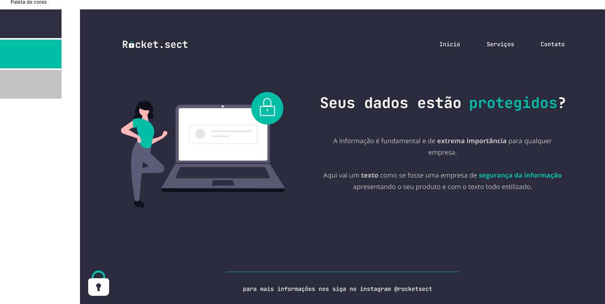

<h1 align="center"> Stage02-Desafio03   Rocket.sect </h1>

 

  

## 🖥️ Tecnologias

Esse projeto foi desenvolvido com as seguintes tecnologias:

- HTML 
- CSS
- Git e Github
- Figma

## 📂 Projeto

  O Desafio 03 é uma criação de uma Landing-Page básica para fortalecer nosso conhecimento sobre alguns conceitos aprendidos em aula na Rocketseat, entre eles:

  <ul>
  <li>Estruturando um projeto HTML</li>
  <li>Uso de tags semânticas HTML</li>
  <li>Conceito box model, flexbox CSS</li>
  <li>Posicionamento e alinhamento de elementos na tela
  </li>
  <li>Aplicação de fontes customizadas</li>
  <li>Espaçamentos.</li>
  <li>Ferramenta de desenvolvimento DevTools</li>
  <li>Acessibilidade e Refatoração</li>
  </ul>
      
  [Visite o projeto online](https://esioalmeida.github.io/Stage02-Desafio03-Rocket.sect/)

 

## 🔖 Layout

Você pode visualizar o layout do projeto através [DESSE LINK](https://www.figma.com/file/laKBbmFF9Lld6Ew9jcQpi7/Explorer-(Copy)?n). É necessário ter conta no [Figma](https://figma.com) para acessá-lo. 

  

## :memo: Licença

Esse projeto está sob a licença MIT.

---

Feito com ♥ by Esio Almeida :wave: [Participe da comunidade da RocketSeat!](https://discord.gg/rocketseat)
